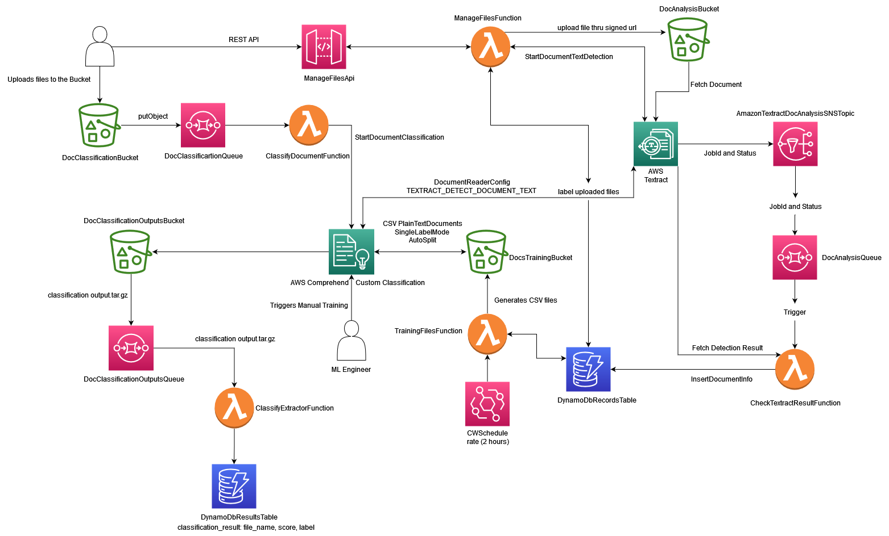

# any-doc-classifier - TBBC - DeeLab

This project contains source code and supporting files for a serverless application that you can deploy with the AWS Serverless Application Model (AWS SAM) 
The project exposes an API to manage documents information and be able to classify them with comprehend. It includes the following files and folders:

- `src` - Code for the application's Lambda functions.
- `template.yaml` - A template that defines the application's AWS resources and reference the stack deployed from the main project. 
- 
To get started, deploy the cloudformation template:
```
  aws cloudformation deploy --template-file infra.yaml --stack-name your-stack-name --capabilities CAPABILITY_NAMED_IAM
```

The template includes: 

* **DocAnalysisRole**: Role for your lambda functions 
* **DocAnalysisComprehendDataRole**: Role assumed by comprehend to access the buckets (input and output buckets) defined in your model
* **DynamoDbRecordsTable**: Table to store the information extracted from your documents
* **DocAnalysisQueue**: you can start a document text detection task (async), this queue receives the notification when this tasks finish and trigger a lambda function
* **DocAnalysisDeadLetterQueuePolicy**: When a notification from the DocAnalysisQueue cannot be processed the message goes to this queue 
* **AmazonTextractDocAnalysisSNSTopic**: When AWS textract finishes the detection task the notification is delivered to the DocAnalysisQueue through this topic
* **DocAnalysisBucket**: All documents you upload go to this bucket (the raw data)
* **DocsTrainingBucket**: Before you can train a classifier with Comprehend you must generate CSV files with the raw data, these files are stored here. 

## Deploy the sample application

To use the AWS SAM CLI, you need the following tools:

* AWS SAM CLI - [Install the AWS SAM CLI](https://docs.aws.amazon.com/serverless-application-model/latest/developerguide/serverless-sam-cli-install.html).
* Node.js - [Install Node.js 16](https://nodejs.org/en/), including the npm package management tool.
* Docker - [Install Docker community edition](https://hub.docker.com/search/?type=edition&offering=community).

To build and deploy the application for the first time reference to the main project: 

If you just want to deploy the APIs and apply new changes to this project, run the following in your shell:

# Initial Architecture 



```bash
sam build --use-container 
cd .aws-sam/build/
# for the first time 
sam deploy --guided 
# afterwards  
sam deploy --config-file ../../samconfig.toml
```

The first command builds the source of your application. The second command will package and deploy your application to AWS
The API Gateway endpoint API will be displayed in the outputs when the deployment is complete.

## Project Structure 

* **file-manager**: this lambda function exposes an Express API with the following routes:
* **extract-data**: S3 trigger to take the file and invoke the Textract API. 
* **textract-checker**: due you can upload files with a couple of pages, we have created a SQS trigger to process asynchronously the files text extraction, the data is then persisted on DynamoDb
* **classify-document** :S3 trigger that takes the file and classify it with AWS comprehend (batch process). A prefix for the file must be defined (classify_<file_name>.extension)

# TODO 

* **API**: attach postman collection to interact with the API
* **S3-BUCKET-CLASSIFICATION**: Bucket from infra to store classification results 
* **S3-TRIGGER-CLASSIFICATION**:  Trigger to extract classification results